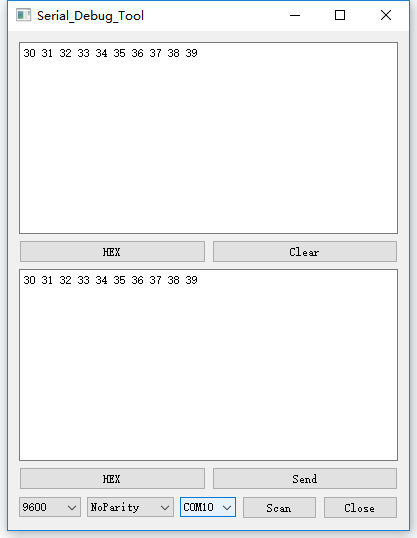
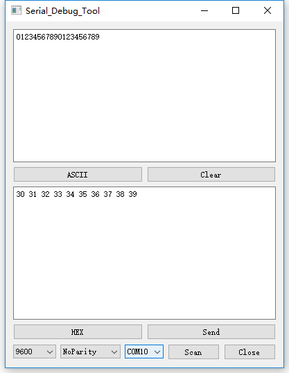
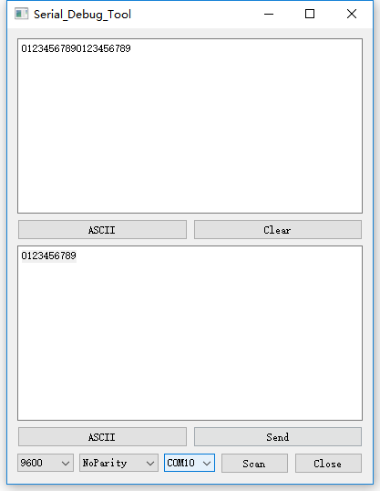
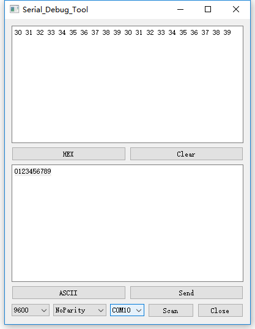

# 基于QT的串口调试工具(源码)--精简版
## 说明
linux下可用的串口调试工具。对串口进行优化，快速多数据程序不卡,不崩溃。
# 效果图

# 基于Linux的开源电子电路开发，有兴趣的朋友可以一起互相学习指教哈。

## 修改记录
> 2019.04.30
>> 修改串口接收后打印方式，修复数据多卡顿现象。   
> 2019.05.09   
>> 修复单次数据超过255字节软件崩溃问题。

Q群推荐:811543500      广告勿扰

基于Kicad的PCB设计Q群:924407324  
QT群推荐:26197884 
